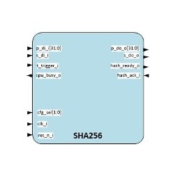
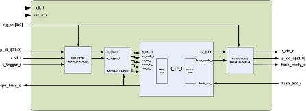
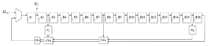
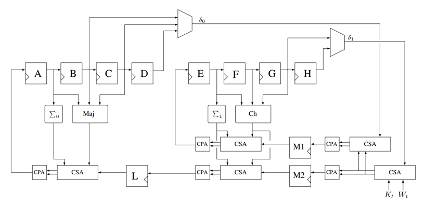
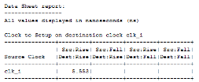

# sha256-vhdl-thesis

> My thesis from 2016, preserved for my future self

SHA-256 is a mathematical funtion to generate a fix width number (256 bit) from any input in a unique and stateless way. Meaning that the exact same input will generate the exact same output all the time. The generated number is unique. The chance of accidental collision is about 4.3 \* 10^(-60), too small to understrand.

## Explain it to me like I'm five

SHA, and hashing in general, is like your name. It would be possible for someone to describe you to another person by enumerating all of your features (a guy, about 6 feet, blone, blue eyes etc.) and eventually the other person would be able to find out who you are, but it is much easier just to refer to you by your name. If you say Peter then this person will immediately understand who you are talking about. We call this naming things. People or objects. Hashing is similar, but instead of a name, we give a number to an object so that we can identify it.

Now, if you tell the name Peter to a person who does not know Peter, he will also not understand what you are talking about. This way on the bus you are free to gossip about Peter, because all the people around will not know who Peter is, only your friend because he can associate the name Peter with the actual Person. Similarly if through SHA I generate a unique number which belongs to your password, I send this number to the server, then anybody listening will not understand that I am sending your password. The server however, knows exactly which number belongs to which password and will know immediately that I am talking about that password.

Now for this to work the names have to be unique. If I talk about Peter, you will know who I am talking about because there are not many Peters that we both know (if yes then you will ask which Peter). Likewise, the number generated by the SHA has to be unique. Also it has to always produce the same result. If I generate a number from your password, the server has to be able to generate the exact same number from the exact same password, otherwise it won't be able to identify.

## Explain how it works to me like I'm a JavaScript developer

Take the most popular implementation of generating a hash code in java(script):

```javascript
const hashCode = (s) => {
  let hash = 7;
  for (let index = 0; index < s.length; i++) {
    hash = (hash * 31 + s.charCodeAt(i)) | 0;
  }
  return hash;
};

const generatedHash = hashCode(JSON.stringify(myObject));
```

This `generatedHash` will be a 32-bit integer associated to the string representation of `myObject`. This way we associated a number to the input in a stateless and (more or less) unique way. Collision chance is much higher than an SHA-256 given that it is only 32 bits and the algorithm is much simpler, but also the runtime is much faster.

Essentially we take an initial prime, as prime multiplication will result in less chance of collision and for each character in the string we shift the hash value to the left by 5 bits (multiplied by 31) add the new character value and mask it with 0 so that we don't overflow the 32 bit output. This is called compression, because it does not matter what is the length of string, we will get a 32 bit result.

So the algorithm: 0. Initialize the hash value -> prime

1. Split the input into iterable chunks -> split to characters
2. For each chunk shift the current hash value -> multiply by 31
3. For each chunk merge the hash value with a number representation of the chunk -> add charCodeAt
4. Make sure the hash value always stays the same width -> masking with 32bit 0.

SHA-256 is the same, just more complex. The initial values are a bunch of constants, which are calculated by the cubic vaalue of the first 63 primes. The input is used as bits, split into 512 bit chunks, each chunk separated into 32 bit words. The hash calculation is done on each 512 bit chunk, similarly as the javascript implementation, using the 32 bit words instead of characters. The hash value of the next chunk is merged with the hash value of the previous chunk for each chunk. Hence we will get a single 256 bit result.

## Algorithm mathematical description

SHA-256 uses six logical functions, where each function operates on 32-bit words, which are represented as x, y, and z. The result of each function is a new 32-bit word.

```
  Ch(x,y,z) = (x & y) ⨁ (∼x & z)
  Maj(x,y,z) = (x & y) ⨁ (x & z) ⨁ (y & z)
  ∑0(x) = ROTR^2(x) ⨁ ROTR^13(x) ⨁ ROTR^22(x)
  ∑1(x) = ROTR^6(x) ⨁ ROTR^11(x) ⨁ ROTR^25(x)
  Sig0(x) = ROTR^7(x) ⨁ ROTR^18(x) ⨁ SHR^3(x)
  Sig1(x) = ROTR^17(x) ⨁ ROTR^19(x) ⨁ SHR^10(x)
```

where the operators are:
| Symbol | Operation |
| --------- | ------------------------------------------------------------------ |
| & | bitwise AND |
| \| | bitwise OR |
| ⊕ | bitwise NOR |
| ~ | bitwise Negate |
| + | MOD 232 addition |
| SRL^n(x) | logical right shift, n-bit |
| SLL^n(x) | logical left shift, n-bit |
| ROTR^n(x) | Circular right shift, n-bit => ROTR^n(x)≡SRL^n(x) \| SRR^(32-n)(x) |

## Implementation



Input interface:

| Input       | Width  | Role                            |
| ----------- | ------ | ------------------------------- |
| clk_i       | 1 bit  | Synchron clock signal           |
| res_n_i     | 1 bit  | Asynchronous reset              |
| cfg_sel     | [1:0]  | Configuration                   |
| p_di_i      | [31:0] | Parallel data input             |
| s_di_i      | 1 bit  | Serial data input               |
| t_trigger_i | 1 bit  | Processing trigger              |
| hash_ack_i  | 1 bit  | Hash output acknowledged signal |

Output interface:

| Output       | Width  | Role                                                       |
| ------------ | ------ | ---------------------------------------------------------- |
| cpu_busy_o   | 1 bit  | Signals that the previous block is under processing        |
| hash_ready_o | 1 bit  | Signals that the processing finished and the hash is ready |
| p_do_o       | [31:0] | 32 bit parallel output                                     |
| s_do_o       | 1 bit  | Serial output                                              |

Mode configuration:

| cfg_sel[1:0] | Input mode | Output mode |
| ------------ | ---------- | ----------- |
| 0b00         | Serial     | Serial      |
| 0b01         | Serial     | Parallel    |
| 0b10         | Parallel   | Serial      |
| 0b11         | Parallel   | Parallel    |



### Scheduler for 32 bit word processing. (16 \* 32 = 512bit)



### Pipeline optimization



#### Optimized performance



```
clk_i = 5.553 ns

f_max = 1 / clk_i = 180 MHz

(512 bit)/68∙f_max = 1292 Mb/s
```
